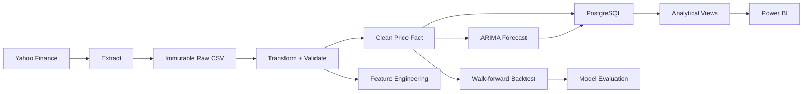

# Architecture

```mermaid
flowchart LR
    A[Yahoo Finance] --> B[Extract]
    B --> C[Immutable Raw CSV]
    C --> D[Transform + Validate]
    D --> E[Clean Price Fact]
    D --> F[Feature Engineering]
    E --> G[PostgreSQL]
    G --> H[Analytical Views]
    H --> I[Power BI]
    E --> J[Walk-forward Backtest]
    J --> K[Model Evaluation]
    E --> L[ARIMA Forecast]
    L --> G
```

The key design principle is separation of concerns:

**source -> validated data -> warehouse -> analytics -> decision layer**.
